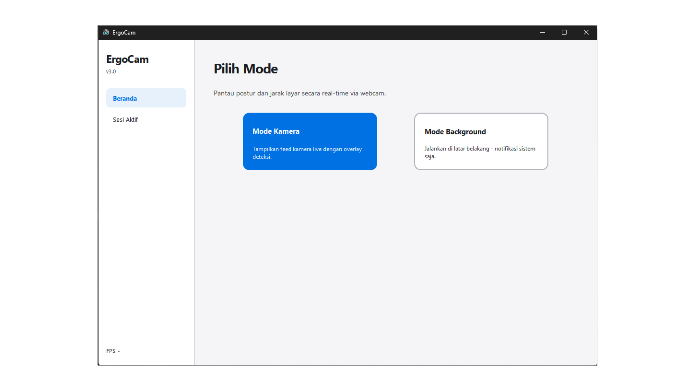
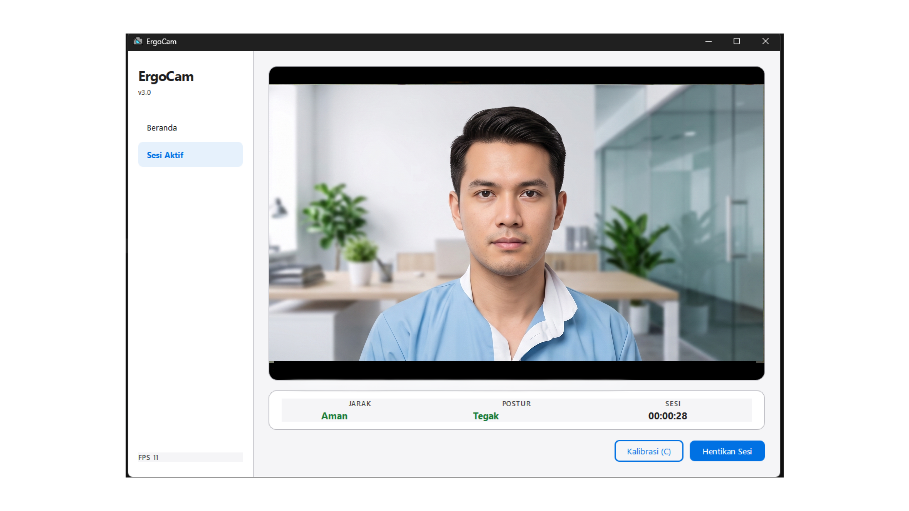

# ErgoCam v3.0

**Real-time ergonomic posture and screen proximity monitoring via webcam.**

Developed as a final project for the K3 (Occupational Health and Safety) course. No additional hardware required - only a standard webcam.


---

## Overview

ErgoCam monitors the user's face through a webcam and provides two real-time ergonomic metrics:

| Metric | Method |
|---|---|
| **Screen Proximity** | Measures the pixel distance between outer eye corners (landmarks 33 and 263). A wider distance indicates the user is sitting farther from the screen. |
| **Posture** | Uses a face foreshortening ratio: chin-to-brow height divided by eye width. This ratio is distance-invariant and decreases when the user slouches forward. |

Both metrics are updated at up to 30 FPS and logged automatically to CSV and XLSX at the end of each session.

---

## Screenshots

| Home | Live Session |
|---|---|
|  |  |

---

## Quick Start

> **Requires Python 3.10, 3.11, or 3.12.** Python 3.13 is not yet supported by mediapipe.
> During Python installation, ensure **"Add Python to PATH"** is checked.

```
1. Download the ZIP from Releases
2. Extract to any folder
3. Double-click run.bat
4. Wait 2-5 minutes on first run (dependencies are installed automatically)
5. The application will open
```

Subsequent launches start immediately without a command window.

---

## Usage

### Auto-Calibration
Upon starting a session, ErgoCam automatically calibrates within 3 seconds of detecting a stable face. Ensure your shoulders are visible in the camera frame before calibration completes. The current posture reading will remain neutral until calibration is done.

Manual recalibration is available at any time by pressing **C** or clicking **Kalibrasi (C)**.

### Status Tiers

**Proximity (Screen Distance)**

| Status | Condition | Indicator |
|---|---|---|
| Aman (Safe) | Eye distance > 90px | Green |
| Agak Dekat (Caution) | 70-90px | Orange |
| Dekat (Warning) | 55-70px | Orange |
| Berbahaya (Danger) | 55px or less | Red |

**Posture**

| Status | Drop from Baseline | Indicator |
|---|---|---|
| Tegak (Upright) | Less than 5% | Green |
| Agak Bungkuk (Slight Slouch) | 5-10% | Orange |
| Bungkuk (Slouch) | 10-15% | Orange |
| Buruk (Severe Slouch) | 15% or more | Red |

### Forced Break
After 2 continuous hours of use, a fullscreen break overlay is displayed with a 5-minute countdown. The session timer resets after the break is completed.

### Session Reports
Logs are saved automatically to the `reports/` folder when the session is stopped or the window is closed.

```
reports/
  ergocam_20260612_143022.csv
  ergocam_20260612_143022.xlsx
```

The XLSX file includes color-coded status rows and a Summary sheet.

---

## Modes

| Mode | Camera Feed | Slouch Threshold | Recommended For |
|---|---|---|---|
| **Mode Kamera** | Visible | 10% drop | Active monitoring |
| **Mode Background** | Hidden | 12% drop | Focused work sessions |

---

## Troubleshooting

**Application closes immediately after running run.bat**
Run `run.bat debug` to keep the window open and display the error message. Check `install.log` in the same folder for details.

**"Kalibrasi gagal" notification appears**
The face was not detected during calibration. Ensure your face is clearly visible in the camera frame and the lighting is adequate.

**Status always displays a dash**
The camera was not found or is currently in use by another application. Close any other camera applications and restart ErgoCam.

**FPS below 5**
Close other resource-intensive applications. ErgoCam targets 30 FPS, but performance may be limited by CPU load.

---

## Build Standalone Executable

```bat
build-exe.bat
```

Output is saved to `dist\ErgoCam\`. Compress that folder into a ZIP for distribution. Recipients do not need Python installed.

---

## Tech Stack

| Package | Purpose |
|---|---|
| PySide6-Essentials | Qt6 UI framework, threading, signals |
| mediapipe >= 0.10.30 | FaceLandmarker Tasks API |
| opencv-python | Webcam capture and frame processing |
| numpy | Frame array operations |
| openpyxl | XLSX report export |

> **Note:** mediapipe 0.10.30 and above removed the `mp.solutions` API. This project uses the Tasks API (`mediapipe.tasks.python.vision.FaceLandmarker`).

---

## Project Structure

```
ergocam/
├── main.py                 Application entry point
├── config.py               Global constants and color palette
├── requirements.txt        Python dependencies
├── run.bat                 Auto-setup launcher
├── build-exe.bat           PyInstaller build script
├── core/
│   ├── detector.py         MediaPipe pipeline, proximity and posture logic
│   ├── camera_worker.py    QThread, FPS tracking, frame capture
│   └── session.py          Session timer, event logging, CSV/XLSX export
└── ui/
    └── main_window.py      PySide6 UI, stylesheet, all screens
```

---

## License

MIT - free to use, modify, and distribute.

---

*ErgoCam v3.0 - Raffa Hayden - K3 Project 2026*
